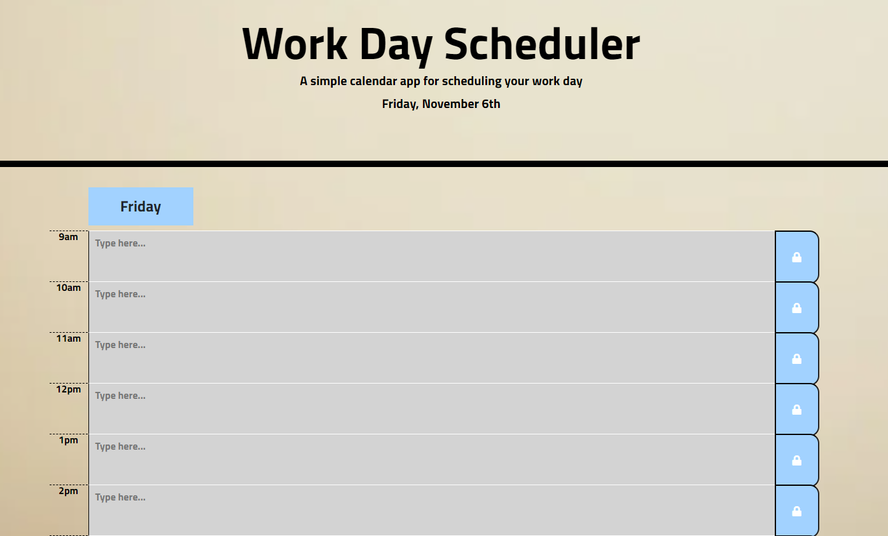

# Daily-Planner
Simple, dynamic work day planner utilizing local storage.

# Usage
To save your actionable items or reminders, just type into the desired text field.  Then click the lock symbol of the corresponding time.  This will allow you to save your schedule for each hour individually.  To clear the row, simply erase the lapsed or changed text, delete, and click the lock button.

## Screenshot and Live Page Link

https://tskading.github.io/Daily-Planner/

## Motivation
This was a project that let me explore jQuery and build myself a little way to organize my day.  
